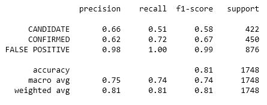
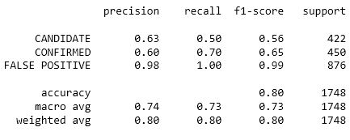
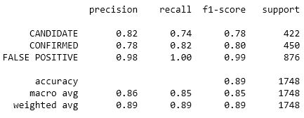
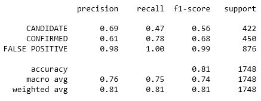

# Exoplanet Exploration

## **Objective:**
The objective of this project is to use Scikit-learn to create machine learning models capable of classifying candidate exoplanets from the NASA Kepler Objects of Interest dataset. After scaling the data and separating the data into training and testing data, the following classification models were tuned and tested:

- Logistic Regression Classifier
- K-Nearest Neighbors Classifier
- Random Forest Classifier
- Support Vector Classifier

## **Tools:**
1. Python - Scikit-learn, Pandas
    
## **Screenshots:**
Classification Report - Logistic Regression Classifier

Classification Report - K-Nearest Neighbors Classifier

Classification Report - Random Forest Classifier

Classification Report - Support Vector Classifier
